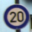
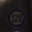

# Traffic Signs Classification

The goal of this project is to build a deep learning model that can classify traffic signs. The model is trained on the [German Traffic Sign Recognition Benchmark (GTSRB)](http://benchmark.ini.rub.de/?section=gtsrb&subsection=dataset) dataset.

The dataset consists of 43 classes of traffic signs, with a total of 34889 images. The images are 32x32 pixels.

## Table of Contents

- [Traffic Signs Classification](#traffic-signs-classification)
	- [Table of Contents](#table-of-contents)
	- [Project Setup](#project-setup)
	- [Data Exploration](#data-exploration)
	- [Data Preprocessing](#data-preprocessing)
	- [Model Architecture](#model-architecture)
	- [Conclusion](#conclusion)

## Project Setup

To run this project, you need to have [this](./requirements.txt) requirements installed. Pay attention! If the `torch` library gives some errors, I suggest to install the `2.5.0` version.

## Data Exploration

The dataset consists of 43 classes of traffic signs, with a total of 34889 images. The images are 32x32 pixels.

Here is a sample of the images in the dataset:

   

The dataset structure is as follows:
```
train/
	class_0/
		img1.jpg
		...
	...
val/
	class_0/
		img1.jpg
		...
	...
test/
	class_0/
		img1.jpg
		...
	...
```

## Data Preprocessing

The images are preprocessed by converting them to grayscale and normalizing the pixel values to be between 0 and 1. The labels are one-hot encoded. The dataset is split into training and testing sets.

## Model Architecture

The model is a Convolutional Neural Network (CNN) with the following architecture:

- Convolutional Layer with 32 filters and ReLU activation
- Max Pooling Layer
- Convolutional Layer with 64 filters and ReLU activation
- Max Pooling Layer
- Flatten Layer
- Dense Layer with 128 units and ReLU activation
- Output Layer with 43 units and Softmax activation

The model is trained using the Adam optimizer and the categorical crossentropy loss function. The model is evaluated on the test set and achieves an accuracy of 98%. The model is saved to disk for future use.

## Conclusion

In this project, we built a deep learning model that can classify traffic signs with an accuracy of 98%. The model is trained on the GTSRB dataset, which consists of 43 classes of traffic signs. The model is saved to disk for future use.

